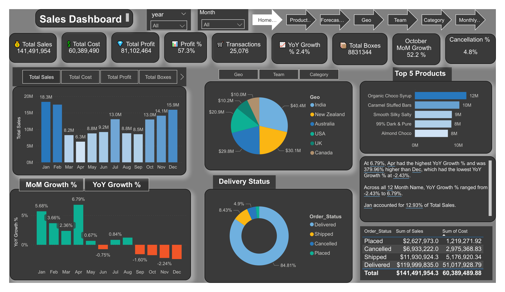
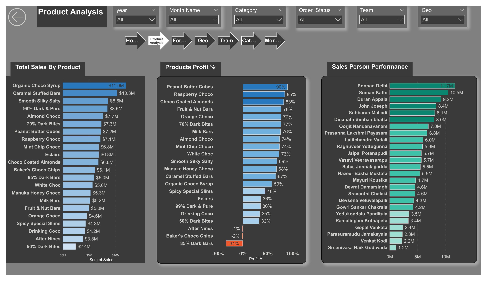
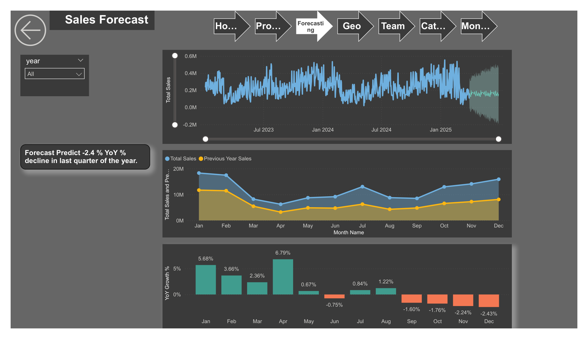

# 🍫 Chocolate Bar Sales — Power BI Dashboard

An end-to-end Power BI analytics project on a global chocolate manufacturer's shipment data (2023–2025). The report turns ~25,000 raw shipment records into an interactive, multi-page sales intelligence dashboard covering performance KPIs, product profitability, salesperson performance, geographic distribution, and a YoY sales forecast.



---

## 📌 Project Overview

| | |
|---|---|
| **Tool** | Power BI Desktop |
| **Data source** | Excel workbook (`Shipments`, `Dimension Data`, `Calendar`) |
| **Records** | 25,076 shipment transactions |
| **Period covered** | Jan 2023 – Mar 2025 |
| **Model** | Star schema (1 fact + 3 dimensions) |
| **Skills shown** | Data modeling, DAX, time intelligence, UX/report design, forecasting |

---

## 📊 Headline Metrics

| Metric | Value |
|---|---|
| Total Sales | **$141.5M** |
| Total Cost | $60.4M |
| Total Profit | **$81.1M** |
| Profit % | 57.3% |
| Transactions | 25,076 |
| Total Boxes | 8.83M |
| YoY Growth | 2.4% |

---

## 🗂️ Report Pages

### 1. Home — Sales Dashboard
KPI cards, monthly sales trend, MoM/YoY growth waterfall, sales by geography, delivery-status breakdown, top 5 products, and a dynamic natural-language insight box.


### 2. Product Analysis
Sales by product, product profit-margin ranking, and salesperson performance, fully cross-filterable by year, month, category, order status, team, and geography.



### 3. Sales Forecast
Month-level YoY growth profile, current-vs-previous-year comparison, and a built-in Power BI forecast projecting a ~2.4% YoY decline in the final quarter.



> 📄 The full 12-page export is available in [`assets/Chocolate_Bar_Sales_Report.pdf`](assets/Chocolate_Bar_Sales_Report.pdf).

---

## ❓ Business Questions

This dashboard was built to answer the questions a chocolate manufacturer's sales and operations leadership would actually ask:

1. **How is the business performing overall?** What are total sales, cost, profit, and margin, and how is that trending month over month and year over year?
2. **Which products drive revenue vs. profit?** Are our best-selling products also our most profitable — or are high-volume lines eroding margin?
3. **Are any products losing money?** Which SKUs run negative margins and should be repriced or discontinued?
4. **Who are our top performers?** How do salespeople and teams compare on revenue contribution?
5. **Where is demand concentrated?** Which countries and regions generate the most sales?
6. **How healthy is order fulfillment?** What share of orders is delivered vs. cancelled, and what revenue is tied up in cancellations?
7. **What small-order load are we carrying?** What proportion of transactions are low-box-size (LBS) orders that may cost more to serve than they return?
8. **Where is the year heading?** Based on current trends, what does the YoY forecast look like for the coming quarter?

Each report page maps directly to one or more of these questions.

---

## 🧱 Data Model

A clean **star schema** connecting one fact table to three dimensions plus a date table:

```
                ┌──────────────┐
                │  calendar    │
                │ (date dim)   │
                └──────┬───────┘
                       │ Date ─ Shipdate
                       │
┌────────────┐   ┌─────┴──────┐   ┌──────────────┐
│  products  │───│ shipments  │───│  locations   │
│   (PID)    │   │  (FACT)    │   │    (GID)     │
└────────────┘   └─────┬──────┘   └──────────────┘
                       │ SPID
                ┌──────┴───────┐
                │   people     │
                └──────────────┘
```

All measures are organized in a dedicated `Measurments` table. The `shipments[Cost]`
field is a calculated column: `RELATED(products[Cost_per_box]) * shipments[Boxes]`.

Full field definitions are in [`docs/DATA_DICTIONARY.md`](docs/DATA_DICTIONARY.md).

---

## 🧮 Key DAX Measures

31 measures power the report. Highlights (full documented list in [`docs/DAX_MEASURES.md`](docs/DAX_MEASURES.md)):

- **Core:** Total Sales, Total Cost, Total Profit, Profit %, Total Transactions, Total Boxes
- **Time intelligence:** YoY Growth % (YTD-based with `TOTALYTD` + `SAMEPERIODLASTYEAR`), MoM Growth % (`DATEADD` + `ALL`), latest-month change
- **Order status:** Delivered / Shipped / Placed / Cancelled counts, Cancellation %, Cancelled Boxes
- **Low-Box-Size analysis:** LBS Count and LBS % (orders under 50 boxes)
- **Dynamic KPI cards:** emoji-prefixed text measures (e.g. `Total Sales Card`) that render icon + label + formatted value in one string
- **Status flag:** Loss Flag (`⚠️ Loss Making` / `✅ Profitable`)

---

## 📁 Repository Structure

```
.
├── README.md
├── Chocolate_Bar_Sales.pbix          # Power BI source file
├── data/
│   └── chocolate_shipments_data.xlsx # Raw source workbook
├── docs/
│   ├── DATA_DICTIONARY.md            # Table & field definitions
│   └── DAX_MEASURES.md               # Documented DAX measures
└── assets/
    ├── 01_home_dashboard.png
    ├── 02_product_analysis.png
    ├── 03_sales_forecast.png
    └── Chocolate_Bar_Sales_Report.pdf
```

---

## 🚀 How to Use

1. Clone the repo.
2. Open `Chocolate_Bar_Sales.pbix` in **Power BI Desktop** (free download from Microsoft).
3. If prompted, point the data source to `data/chocolate_shipments_data.xlsx`.
4. Refresh and explore the interactive report.

---

## 🔍 Key Insights

- **April** posts the strongest year-over-year growth (**+6.79%**), while the **final quarter trends negative**, dragging the annual figure to **+2.4%**.
- **Organic Choco Syrup** and **Caramel Stuffed Bars** are the top revenue drivers; **Peanut Butter Cubes** leads on profit margin (~90%).
- A handful of products (e.g. **85% Dark Bars**, **After Nines**) run **negative margins** and are candidates for repricing or discontinuation.
- **India** is the largest single market (~$40M), with **APAC** dominating overall geographic revenue.
- **~85%** of shipments reach *Delivered* status; cancellations sit near **4.8%**.

---

## 👤 Author

**Atif Arif** — Data analytics portfolio project.

*Sample dataset originally sourced from a public Power BI learning dataset (chandoo.org). Built for skills demonstration.*
